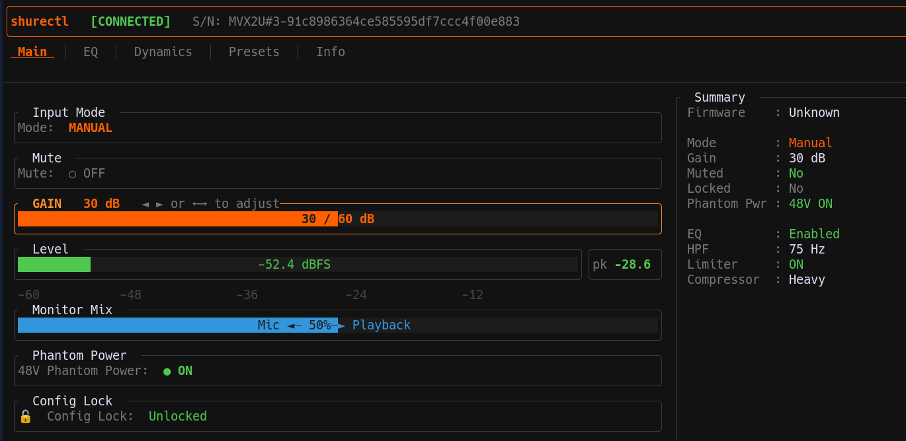

# shurectl

An open-source terminal UI configurator for the Shure XLR-to-USB audio
interfaces and microphones on Linux and macOS. Replaces the Windows/Mac-only ShurePlus MOTIV Desktop app.



---

## Supported Devices
- MVX2U Gen 1 — Digital Audio Interface
- MVX2U Gen 2 — Digital Audio Interface
- MV6 — USB Gaming Microphone
- MV7+ — USB/XLR Dynamic Microphone

---

## Features

### All Devices
- **Gain Control** — Auto Level / Manual toggle
- **Mic Mute** — toggle mute
- **Monitor Mix** — mic vs. playback blend slider
- **Compressor** — Off / Light / Medium / Heavy
- **High-Pass Filter** — Off / 75 Hz / 150 Hz
- **Real-time Level Meter** — dBFS input meter with peak-hold display
- **4 Preset Slots** — save and load named presets stored as TOML in `~/.config/shurectl/presets/`
- **Device Info** — serial number
- **Demo mode** — run without a device plugged in (`--demo`)

### MVX2U Gen 1
- **Gain range** — 0–60 dB
- **Phantom Power** — 48V on/off; warns if enabled when muting ribbon mics
- **5-band Parametric EQ** — per-band enable, gain (−8 to +6 dB in 2 dB steps)
- **Limiter** — enable/disable
- **Panel Lock** — lock the physical panel controls on the device
- **Auto Level controls** — mic position (Near/Far), tone (Dark/Natural/Bright), gain environment (Quiet/Normal/Loud)

### MVX2U Gen 2 -  Builds on Gen 1 features with the following
- **5-band Parametric EQ** — gain (−8 to +6 dB in 0.5 dB steps)
- **Tone** — Dark / Natural / Bright
- **Real-time Denoiser** — enable/disable
- **Popper Stopper** — enable/disable
- **Gain Lock** — hardware freeze of the gain control (Manual mode only)

### MV6
- **Gain range** — 0–36 dB
- **Tone** — Dark / Natural / Bright
- **Real-time Denoiser** — enable/disable
- **Popper Stopper** — enable/disable
- **Mute Button Disable** — prevent accidental mutes
- **Gain Lock** — hardware freeze of the gain control (Manual mode only)

### MV7+ - Builds on MV6 features with the following
- **Reverb** — output and monitor enable/disable; Type: Plate / Hall / Studio; Intensity: 0–100%
- **LED Panel** — Behavior (Live / Pulsing / Solid), Brightness (Low / Med / High / Max), theme and custom RGB color per mode

---

## Platform Setup

### Linux — udev Rules (Required for Non-Root Access)

Without a udev rule, `/dev/hidrawN` for the device is only accessible by root.

Create `/etc/udev/rules.d/62-shure.rules`:

```
ACTION!="remove", SUBSYSTEM=="hidraw", ATTRS{idVendor}=="14ed", ATTRS{idProduct}=="1013", TAG+="uaccess"
ACTION!="remove", SUBSYSTEM=="hidraw", ATTRS{idVendor}=="14ed", ATTRS{idProduct}=="1033", TAG+="uaccess"
ACTION!="remove", SUBSYSTEM=="hidraw", ATTRS{idVendor}=="14ed", ATTRS{idProduct}=="1026", TAG+="uaccess"
ACTION!="remove", SUBSYSTEM=="hidraw", ATTRS{idVendor}=="14ed", ATTRS{idProduct}=="1019", TAG+="uaccess"
```

Then reload udev and replug your device:

```bash
sudo udevadm control --reload-rules
sudo udevadm trigger
```

Verify the device appears:

```bash
shurectl --list
# Found 1 Shure device(s):
#   /dev/hidraw2 | Shure MVX2U Gen 2 | S/N: MVX2U GEN 2#2-a646351d...
```

### macOS — No Extra Setup Required

On macOS, IOKit grants user-space access to HID devices without extra configuration.
Plug in your device and run `shurectl --list` to confirm detection.

---

## Installing

### From source

```bash
git clone https://github.com/Humblemonk/shurectl.git
cd shurectl
cargo build --release
```

The binary will be at `target/release/shurectl`.

To install system-wide:

```bash
sudo install -m 755 target/release/shurectl /usr/local/bin/
```

Or for your user only:

```bash
install -m 755 target/release/shurectl ~/.local/bin/
```

### Via cargo install

```bash
cargo install --git https://github.com/Humblemonk/shurectl.git
```

---

## Usage

```bash
shurectl                         # Connect to first detected device and launch TUI
shurectl --device <path>         # Connect to a specific device (use --list to find paths)
shurectl --demo                  # Run without a device (explore the UI)
shurectl --list                  # List detected Shure devices and exit
```

### Keyboard Shortcuts

| Key | Action |
|-----|--------|
| `Tab` / `Shift+Tab` | Switch section |
| `↑` / `k` | Focus previous control |
| `↓` / `j` | Focus next control |
| `←` / `h` | Decrease value |
| `→` / `l` | Increase value |
| `Enter` / `Space` | Toggle boolean / cycle option |
| `f` | Flatten EQ (zero all bands) — EQ tab, Gen 1 and Gen 2 only |
| `r` | Refresh state from device |
| `s` | Save preset (on Presets tab, focused slot) |
| `d` | Delete preset (on Presets tab, focused slot) |
| `?` | Toggle help overlay |
| `q` / `Ctrl+C` | Quit |

---

## Presets

Presets are stored as human-readable TOML files in `~/.config/shurectl/presets/`:

```
~/.config/shurectl/presets/
├── preset_1.toml
├── preset_2.toml
├── preset_3.toml
└── preset_4.toml
```

Each file captures all configurable DSP settings (gain, mode, EQ, dynamics, monitor mix, etc.)
but not hardware-identity fields like serial number or firmware version. Files are hand-editable.

On the **Presets tab**:
- Navigate to a slot with `↑`/`↓`
- Press `Enter` on the name field to rename it (type, then `Enter` to confirm or `Esc` to cancel)
- Press `Enter` on the actions row to load a filled preset — all settings are applied to the device immediately
- Press `s` to save the current device state into the focused slot
- Press `d` to delete the focused slot

---

## Troubleshooting

**"Cannot open device"** — device not found or a permissions issue.
Run `shurectl --list` to check detection. On Linux, try `sudo shurectl` to confirm it's a udev permissions issue. On macOS, ensure no other software has exclusive access to the device.

**Gain slider is greyed out in Auto Level mode** — This is correct hardware behaviour;
the device ignores gain commands in Auto Level mode. Switch to Manual mode first.

**PipeWire/PulseAudio volume vs. device gain** — This tool controls the **hardware DSP gain**
on the device itself, not the OS capture volume level. Both can be set independently.

---

## Acknowledgements

Initial protocol reverse-engineering credit goes to **PennRobotics** and the
[shux project](https://gitlab.com/PennRobotics/shux) (Apache 2.0), without which
this tool would not exist. If you find shurectl useful, consider starring their
repository.

This project was developed with the assistance of Claude (Anthropic) as a pair-programmer
throughout: writing and reviewing Rust code, reasoning about the HID protocol, and catching
issues during implementation. All code was reviewed and tested by the author before merging.

---

## Legal

Protocol implementation is based on publicly documented USB HID packet captures
by PennRobotics (shux project, Apache 2.0) as well as author's own usbmon captures. No Shure software was used, decompiled,
or examined in the creation of this tool.

shurectl is not affiliated with or endorsed by Shure Incorporated.
