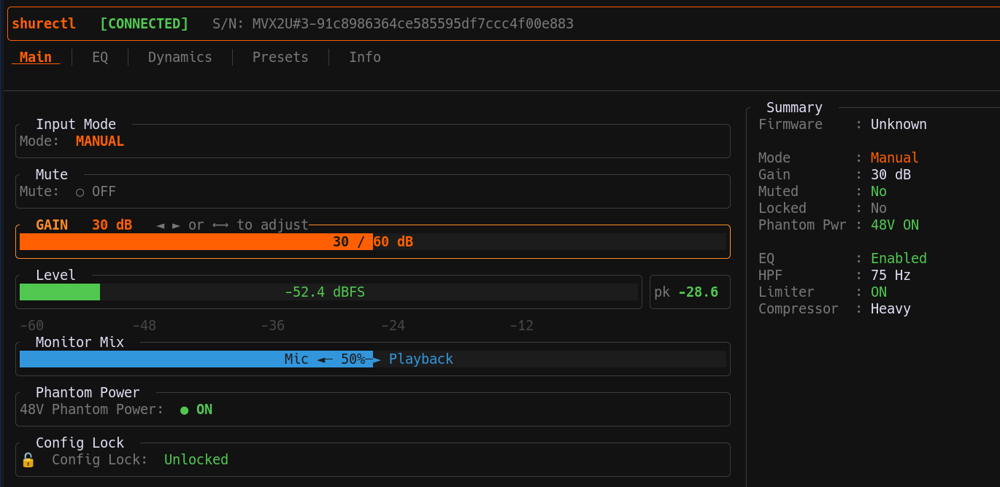

# shurectl

An open-source terminal UI for configuring Shure USB microphones and audio interfaces on Linux,
macOS, and Windows. A lightweight alternative to the ShurePlus MOTIV desktop app.



**Supported devices:** MVX2U Gen 1, MVX2U Gen 2, MV6, MV6 Gen 2 (basic), MV7, MV7+

- Gain, mute, Auto Level / Manual mode, and monitor mix
- EQ, compressor, limiter, high-pass filter, denoiser, and popper stopper, where the device
  has them
- Reverb and LED settings on the models that support them
- Real-time level meter with peak hold
- 4 preset slots, saved as editable TOML files
- Mute from the command line without opening the TUI

Which controls each model has is listed under [Device support](#device-support).

## Install

**Arch Linux (AUR)** — includes the udev rules; replug the device after installing.

```bash
paru -S shurectl        # or: yay -S shurectl
```

**Homebrew (macOS / Linux)** — builds from source, so the first install takes a minute or two.

```bash
brew install humblemonk/shurectl/shurectl
```

**Cargo**

```bash
cargo install --git https://github.com/Humblemonk/shurectl.git
```

On Linux this needs `libasound2-dev` and `libudev-dev` (Debian/Ubuntu names). On Windows it
needs the [MSVC build tools](#building-from-source).

### Linux: allow access without root

Skip this if you installed from the AUR. Otherwise install the udev rules and replug the
device:

```bash
sudo curl -fsSLo /etc/udev/rules.d/62-shure.rules \
  https://raw.githubusercontent.com/Humblemonk/shurectl/master/62-shure.rules
sudo udevadm control --reload-rules && sudo udevadm trigger
```

macOS and Windows need no setup.

## Usage

```bash
shurectl                  # Connect to the first detected device
shurectl --list           # List detected Shure devices
shurectl --device <path>  # Connect to a specific device from --list
shurectl --demo mv7plus   # Try the UI without a device: mvx2u, mvx2u-gen2, mv6, mv7, mv7plus
shurectl --mute           # Toggle mute without launching the TUI (or --mute on / --mute off)
shurectl --mute status    # Print "on" or "off", e.g. for a status bar
shurectl --preset 2       # Load preset slot 2 (1-4) without launching the TUI
```

| Key | Action |
|-----|--------|
| `Tab` / `Shift+Tab` | Switch section |
| `↑` / `k` | Focus previous control |
| `↓` / `j` | Focus next control |
| `←` / `h` | Decrease value |
| `→` / `l` | Increase value |
| `Enter` / `Space` | Toggle boolean / cycle option |
| `f` | Flatten EQ (zero all bands) — EQ tab, MVX2U Gen 1 and Gen 2 only |
| `r` | Refresh state from device (reconnects right away if it was unplugged and plugged back in) |
| `s` | Save preset (on Presets tab, focused slot) |
| `d` / `Delete` | Delete preset (on Presets tab, actions row of the focused slot) |
| `?` | Toggle help overlay |
| `q` / `Ctrl+C` | Quit |

The mouse works too: click a tab to switch to it, click a control to select it and click
it again to toggle it, or scroll over a slider to adjust it. Factory Reset still needs `Enter`
to confirm. Most terminals let you hold `Shift` to select text while the mouse is captured.

## Presets

On the Presets tab, `s` saves the current settings into the focused slot, `Enter` on its
actions row loads it onto the device, and `Enter` on its name renames it. Each slot is a
hand-editable file, `preset_1.toml` through `preset_4.toml`, in:

| Platform | Location |
|----------|----------|
| Linux | `~/.config/shurectl/presets/` |
| macOS | `~/Library/Application Support/shurectl/presets/` |
| Windows | `%APPDATA%\shurectl\presets\` |

## Troubleshooting

**"Cannot open device"** — device not found or a permissions issue.
Run `shurectl --list` to check detection. On Linux, try `sudo shurectl` to confirm it's a udev permissions issue. On macOS and Windows, ensure no other software (e.g. ShurePlus MOTIV) has exclusive access to the device.

**Header stays `[DISCONNECTED]` with the device plugged in** — shurectl can see the
device but cannot open it. Check the status bar for the reason, then follow "Cannot open
device" above. With two identical devices that report no USB serial number, restart
shurectl with `--device`.

**"Ignored an unrecognised reply" in the status bar** — the device answered with a setting
shurectl doesn't know, often after a firmware update. Everything else loaded normally.
Please open an issue with the message and the firmware version from the Info tab.

**No gain slider in Auto Level mode** — This is correct hardware behaviour; the device
sets its own gain in Auto Level mode, so the slider is hidden. Switch to Manual mode first.

**Gain won't change** — On the MVX2U Gen 2 and MV6, check that Gain Lock is off.

**MV7: MOTIV stops showing the mic's settings** — The MV7 has a single command channel
that MOTIV and shurectl share. Quit MOTIV before using shurectl with an MV7; if MOTIV
already lost the mic, quit it, replug the mic, and reopen it.

**PipeWire/PulseAudio volume vs. device gain** — This tool controls the **hardware DSP gain**
on the device itself, not the OS capture volume level. Both can be set independently.

## Device support

<details>
<summary>Controls available on each model</summary>

✓ = available · **Manual** / **Auto** = only in that mode · — = not on this device

| Control | MVX2U Gen 1 | MVX2U Gen 2 | MV6 | MV7 | MV7+ |
|---------|:-----------:|:-----------:|:---:|:---:|:----:|
| **Main tab** | | | | | |
| Mode (Auto Level / Manual) | ✓ | ✓ | ✓ | ✓ | ✓ |
| Mute | ✓ | ✓ | ✓ | ✓ | ✓ |
| Gain | Manual, 0–60 dB | Manual, 0–60 dB | Manual, 0–36 dB | Manual, 0–36 dB | Manual, 0–36 dB |
| Gain Lock | — | Manual | Manual | — | — |
| Monitor Mix (mic ↔ playback, 0–100%) | ✓ | ✓ | ✓ | ✓ | ✓ |
| Playback Mix (second mix, independent of Monitor Mix) | — | — | — | — | ✓ |
| Phantom Power (48V) | ✓ | ✓ | — | — | — |
| Config Lock | ✓ | — | — | ✓ | — |
| Mic Position (Near / Far) | Auto | — | — | Auto | — |
| Auto Tone (Dark / Natural / Bright) | Auto | — | — | Auto | — |
| Gain Environment (Quiet / Normal / Loud) | Auto | — | — | — | — |
| **EQ tab** | | | | | |
| 5-band Parametric EQ (−8 to +6 dB) | Manual, 2 dB steps | Manual, 0.5 dB steps | — | — | — |
| Tone (Dark ↔ Natural ↔ Bright slider, 10% steps) | — | Auto | ✓ | — | ✓ |
| EQ Preset (Flat / High Pass / Presence Boost / both) | — | — | — | Manual | — |
| **Dynamics tab** | | | | | |
| Limiter | Manual | Manual | — | — | ✓ |
| Compressor (Off / Light / Medium / Heavy) | Manual | Manual | — | Manual | ✓ |
| High-Pass Filter (Off / 75 Hz / 150 Hz) | Manual | ✓ | ✓ | — | ✓ |
| Denoiser | — | ✓ | ✓ | — | ✓ |
| Popper Stopper | — | ✓ | ✓ | — | ✓ |
| Mute Button Disable | — | — | ✓ | — | ✓ |
| **Other tabs** | | | | | |
| Reverb (Plate / Hall / Studio, intensity 0–100%, output and monitor on/off) | — | — | — | — | ✓ |
| LED Panel | — | — | — | Live Meter, Night Mode | Behavior, Brightness, Theme, custom RGB |
| Rename device (Info tab) | ✓ | ✓ | ✓ | — | ✓ |
| Factory Reset (Info tab) | — | — | — | — | ✓ |

Every model also has the level meter, presets, an Info tab (serial number, device name,
firmware version), `--mute`, `--preset`, and `--demo`.

- The MV6 Gen 2 follows the MV6 column for now. Its 5-band EQ, Denoiser level, and Auto
  Level tuning are not supported yet ([#99](https://github.com/Humblemonk/shurectl/issues/99)).
- Gain moves in 1 dB steps, except on the MV7, which uses the hardware's own 1.5 dB step.
- On the MVX2U Gen 1 and MV7, the device manages EQ and Dynamics itself in Auto Level
  mode, so those tabs are locked until you switch to Manual.
- On the MVX2U Gen 1, the EQ also has a master enable and a per-band enable.
- The limiter MOTIV shows for the MV7 is processing inside the MOTIV app, not a mic
  setting, so shurectl does not offer it.
- Factory Reset asks for confirmation, and the mic disconnects afterwards.

</details>

## Building from source

<details>
<summary>Build and install steps</summary>

```bash
git clone https://github.com/Humblemonk/shurectl.git
cd shurectl
cargo build --release
install -m 755 target/release/shurectl ~/.local/bin/          # for your user
sudo install -m 755 target/release/shurectl /usr/local/bin/   # or system-wide
```

On Linux, install `libasound2-dev` and `libudev-dev` first.

On Windows, install [Microsoft C++ Build Tools](https://visualstudio.microsoft.com/visual-cpp-build-tools/)
with the "Desktop development with C++" workload, then make MSVC your active toolchain:

```
rustup default stable-x86_64-pc-windows-msvc
```

</details>

## Credits and legal

Initial protocol reverse-engineering credit goes to **PennRobotics** and the
[shux project](https://gitlab.com/PennRobotics/shux) (Apache 2.0), without which this tool
would not exist. If you find shurectl useful, consider starring their repository. The
protocol implementation is based on their published USB HID packet captures and the
author's own usbmon captures.

shurectl does not update device firmware. The firmware-update commands are intentionally
left out of its protocol implementation, and it never sends them. To update firmware, use
ShurePlus MOTIV; the Info tab shows the firmware version your device is running.

shurectl is not affiliated with or endorsed by Shure Incorporated.
